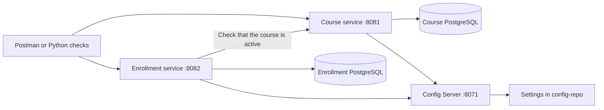
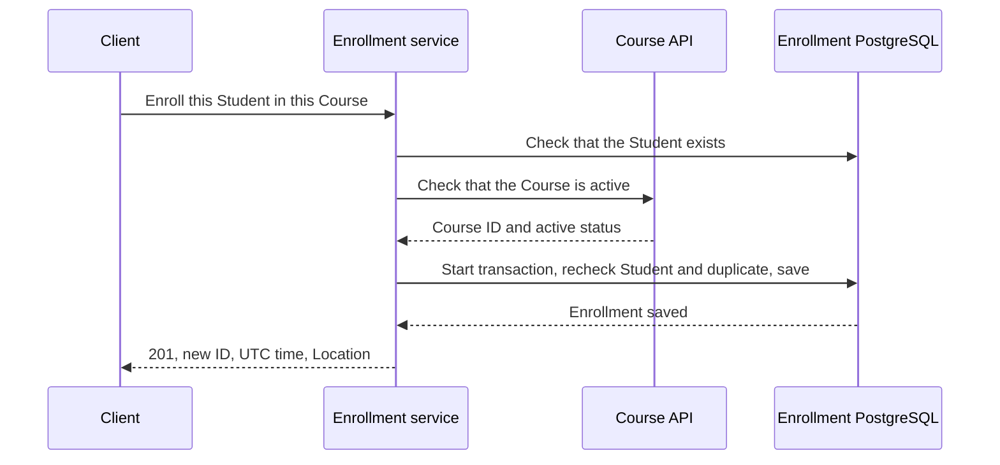

# How the project works

UAccess has three Java services. Follow the [README](../README.md) to start them or the [Phase 1 demo](phase1-demo.md) to try them.

## What each service does

| Service | Job |
| --- | --- |
| Course | Manages courses in its own database. |
| Enrollment | Manages students and enrollments in a separate database. |
| Config Server | Supplies settings to both services. |

PostgreSQL stores the records. JPA lets Java read and save them. Docker volumes keep the database files when containers are replaced.

Enrollment asks Course for information through its API. Each service accesses only its own database.

## What happens when a student enrolls?

Enrollment checks that the student exists and the course is active, then saves the enrollment. Success returns **201** with a new ID and enrollment time.

The Course check happens before the database transaction, which groups the saving steps so they succeed or fail together.

## Rules on Enrollment

- **Duplicates:** A student can have only one enrollment in a course. The database enforces this even when requests arrive together.
- **Archiving:** Keeps the course and existing enrollments, but blocks new enrollments.
- **Dropping:** Deletes the enrollment. Enrolling again creates a new ID and time.
- **Course outages:** Block new enrollments. Student requests and reading, listing, or dropping existing enrollments still work while Enrollment's database is available.

## How the Java code is organized

- **Controllers** receive API requests and check their input.
- **Services** apply the rules.
- **Repositories** read and save records through JPA.

See the [API guide](api.md) for request examples, [field rules](api.md#field-rules), lists, and error responses.

## Limits of this phase

Phase 1 covers courses, students, and enrollments. It does not include user login, a user interface, course sections, capacity limits, prerequisites, grades, or billing.

The course is checked before saving. It could be archived between that check and the save; this phase does not coordinate changes across both databases.
